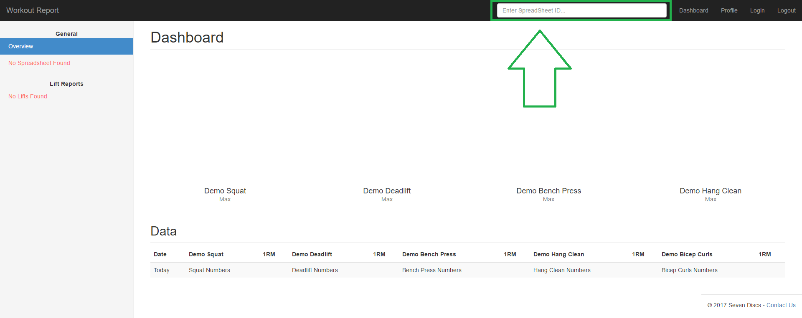

### Getting Started

#### Quick Start
[Quick Start](#quick-start)
1. View the [Workout Report template]({{ site.workout_template_url }}) in Google Sheets.

2. Make a copy of the Workout Report template and save it in your Google Drive. If you do not already have a Google account, you will need to make one now.

3. Your new Workout spreadsheet should open in a new browser tab. This new spreadsheet will be where you update and save your lift data.

4. Next, copy the URL or Spreadsheet ID from the top of the page.

5. Paste it into the white text box at the top of the [Workout Report]({{ site.website_url }}) website. Note: If you are not logged in, it will redirect you to the login page.

6. After entering your spreadsheet's URL or ID, the Workout Report dashboard will automatically be populated with your data! Data is refreshed on login or when the Spreadsheet ID textbox is triggered.

#### Data Input and Validation
[Data Input and Validation](#data-input-and-validation)
The Workout Report is very particular on the format of your data. All invalid data will be grayed out and ignored on the dashboard or single lift's spreadsheet view. I have create a [Workout Report template]({{ site.workout_template_url }}) that shows a ton of examples on how data should be recorded. Follow the below rule set for specifics on how data is interpreted and parsed.

##### Spreadsheet Header Rules
- Row 1 is reserved for the "Date" and lift headers.
    - Cell A1 is for the "Date" title.
    - All other Row 1 cells may be used for other lifts. The lift names must match exactly to those of your teammates, otherwise they will be considered other lifts. If you do not want a column to be included, then do not add a header to it.
    - The order of your lifts does not mater. However, "Date" must be Column A.
    - Note: Do not place a non-titled column in between other titled columns. This bug is tracked by [issue 2]({{ site.github.issues_url }}/2).

##### Spreadsheet Data Rules
- All cells below Row A are considered data cells and must follow a strict format.
    - "Date" cells must be in the numbered date format: `[MONTH]/[DAY]/[YEAR]` or `[DAY]/[MONTH]/[YEAR]`. All rows without a date will be ignored.
        - Examples: `2/25/2017` or `25/2/2017`
        - Written months (Ex: January or Jan) or shorthand years are not allowed. (Ex: `17)
    - Lift data cells must follow the generic format of: `[WEIGHT]x[REPETITIONS]*[SETS]`. Additional sets of varying weight and repetitions can be separated by the `-` symbol. This format can cover every  weight/repetition/set possibility. Other shorthand formatting specifications are below.
        - Single numbers are considered a weight: `[WEIGHT]`
            - Ex: `400` is interpreted as 400 at 1 rep for 1 set. The single repetition and set are implied.
        - For single sets, use the format: `[WEIGHT]x[REPETITIONS]`
            - Ex: `45x8` is interpreted as 45 pounds at 8 reps. The single set is implied.
        - Multiple sets use the following format: `[WEIGHT]x[REPETITIONS]*[SETS]`
            - Ex: `165x10*2` is interpreted as 165 pounds at 10 reps for 2 sets.
        - When filling out multiple sets at differing reps or weight use the following format: `[WEIGHT]x[REPETITIONS]*[SETS]-[WEIGHT]x[REPETITIONS]*[SETS]-[WEIGHT]x[REPETITIONS]*[SETS]`
            - This format could go on forever.
            - Ex: `165x10*2-175x8*2` is interpreted as 165 pounds at 10 reps for 2 sets and 175 pounds at reps 8 for 2 sets.
- Data Parsing Explained:
    - Reps are initiated by a `x` character.
    - Sets are initiated by a  `*` (star) character.
    - Multiple sets at different reps or weight are separated by a `-` (hyphen) character.
