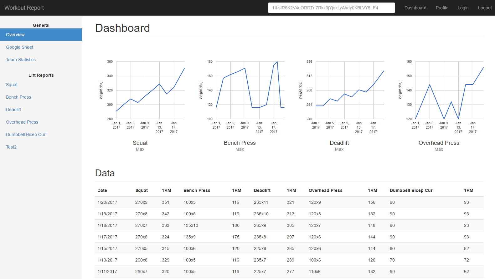

### Overview

Monitor your workout and lifting progress through the Workout Report website. Connect to a Google Spreadsheet through Google login. Gain a larger understanding of your most popular lifts on the dashboard. Dive into each lift and find associated videos for form and additional workout plans (soon). Get your teammates to join and compare your overall progress.

View the tabs on the left hand side to learn more about Workout Report. All pull requests and issue reports are welcome!

This site is intended to capture the Workout Report's functionality and progress when it can no longer by maintained or supported.
